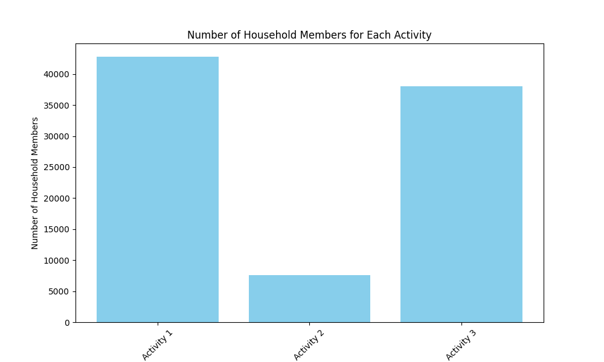
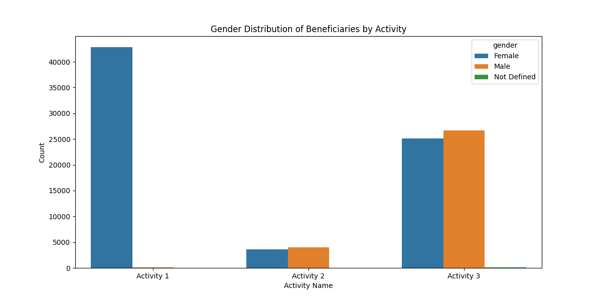
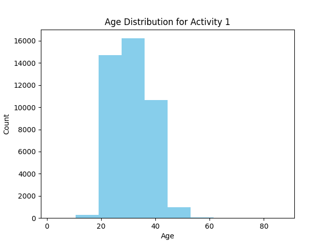
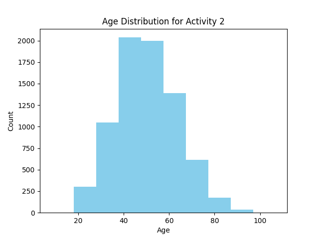
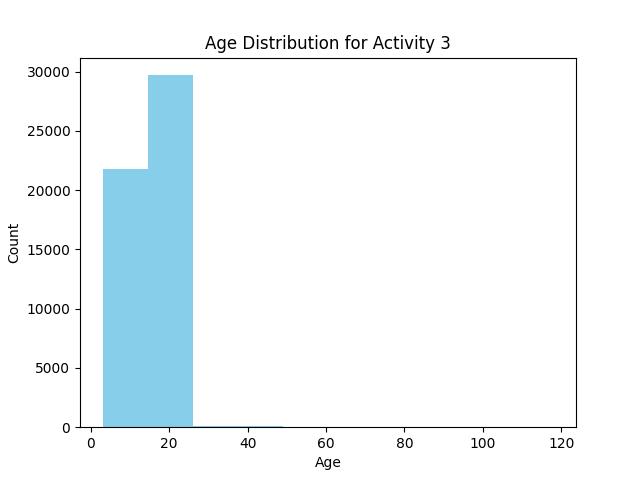
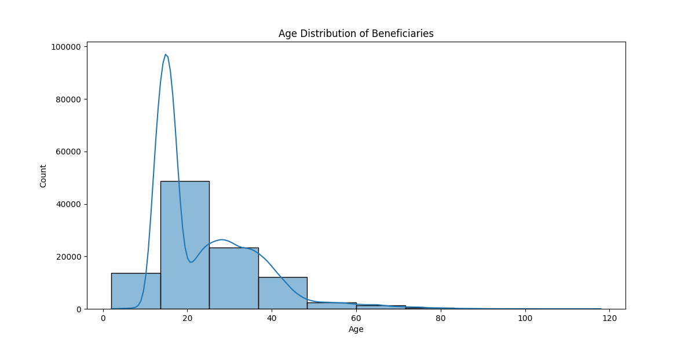
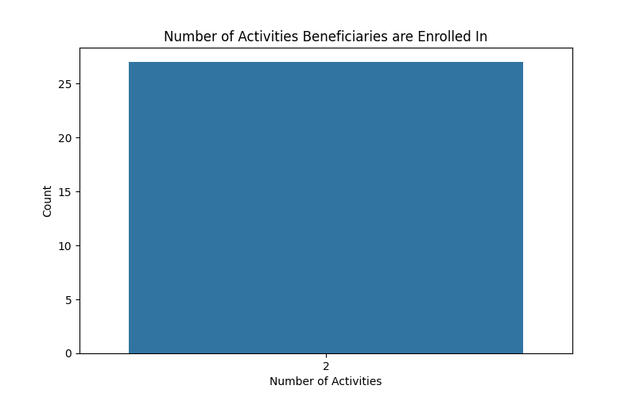

# The Number of Household Members For Each Activity

The analysis of the number of household members participating in each activity reveals valuable insights into the scale and reach of our programs. With Activity1 having more than 43,000 household members, Activity2 with around 7,000, and Activity3 with around 38,000, we can see variations in the size of beneficiary households across different initiatives. This information allows us to tailor our services and support to accommodate the varying household sizes effectively. By understanding these differences, we can optimize our resources, design targeted interventions, and enhance the overall impact and relevance of our programs. Moreover, by identifying trends in household member distribution, we can adjust our outreach strategies and service delivery to better meet the evolving needs of beneficiary households, fostering stronger community engagement and sustainable outcomes
# Geneder Distribution
The analysis of gender distribution among beneficiaries participating in each activity provides valuable insights into the diversity and inclusivity of our programs. In Activity1, we observe a male-dominated participation with more than 43,000 male beneficiaries. In Activity2, there is a more balanced representation with around 4,000 male beneficiaries and around 4,500 female beneficiaries. Activity3 shows a nearly equal gender distribution with around 26,000 male beneficiaries and around 27,000 female beneficiaries. Understanding these gender dynamics allows us to tailor our services and interventions to address the specific needs and preferences of male and female beneficiaries. By leveraging this information, we can ensure that our programs are inclusive, responsive to gender-specific requirements, and effectively meet the diverse needs of our beneficiary population. Moreover, by identifying gender distribution trends, we can refine our outreach strategies and program design to enhance engagement and promote gender equality within our initiatives.

# Age Distribution For Each Activity

- Activity 1:

20-27 years old: There are 15,000 individuals in this age group participating in Activity 1. This age group represents a significant portion of the participants, indicating a strong interest or engagement from young adults.
28-34 years old: With 16,000 individuals in this age group, there is a slightly higher participation rate compared to the 20-27 age group. This suggests that the activity appeals to a broad range of young to middle-aged adults.
35-40 years old: The participation drops to 11,000 individuals in this age group. This could indicate a decline in interest or engagement among individuals in their late thirties to early forties.

- Activity 2:

20-30 years old: Only 400 individuals in this age group are participating in Activity 2. This suggests that the activity may not be as popular among young adults.
30-60 years old: The participation significantly increases to 6,000 individuals in this age group. This indicates a strong interest or engagement from individuals in their thirties to sixties.
60-80 years old: There are 2,000 individuals in this age group participating in Activity 2. This could represent a niche market or a specific target audience within the older demographic.

- Activity 3:

4-10 years old: There are 20,000 participants in this age group for Activity 3, indicating a high level of engagement from children. This suggests that the activity is popular among younger children.
11-25 years old: With 30,000 individuals in this age group participating, there is a significant interest from teenagers and young adults. This age group represents a substantial portion of the participants, indicating a broad appeal among youth and young adults.

The analysis of age distribution among beneficiaries reveals valuable insights into the demographic composition of our target audience. By understanding the age distribution, we can tailor our programs and services to better meet the diverse needs of beneficiaries across different age groups. This information allows us to design targeted interventions, allocate resources effectively, and enhance the overall impact and relevance of our initiatives. Additionally, by identifying age-specific trends and preferences, we can optimize our communication strategies and engagement efforts to foster stronger relationships with beneficiaries and drive positive outcomes for both the organization and the communities we serve.
# The Extent To Which Beneficiaries Appear In More Than Activity
